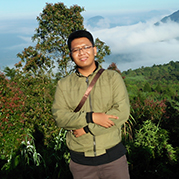

# BIODATA

- Nama Lengkap    : Eko Hardiyanto
- Nama Panggilan  : Eko
- NIM             : 1301174099
- Jurusan         : S1 Teknik Informatika
- Angkatan        : 2017
- TTL             : Batang, 19 April 1999
- Jenis Kelamin   : Laki-laki
- Asal            : Depok, Jawa Barat
- Kontak
  - No. HP          : 085716100054
  - Email           : ehardi19@gmail.com / ehardi@student.telkomuniveristy.ac.id
  - Line            : eko_hardi
  - Facebook        : [ekohardiyanto19](https://web.facebook.com/ekohardiyanto19)
  - Instagram       : [ekohardiyanto19](https://www.instagram.com/ekohardiyanto19)
  - GitHub          : [ehardi19](https://github.com/ehardi19)

- Riwayat Penidikan

Instansi     | Tahun
------------ | -------------
Telkom University - S1 Teknik Informatika | 2017-Present
SMAN 4 Depok - IPA | 2014-2017
SMPN 103 Jakarta  | 2011-2014
SDN Cibubur 05  | 2005-2011

- Hobi

- [x] Belajar Programming
- [x] Gaming

## Motto Hidup
> _Tidak ada kata tidak bisa, yang ada hanyalah mau atau tidak mau_

# ALASAN INGIN MASUK COMPUTING

> Hi, nama saya Eko Hardiyanto :smile:, berikut adalah alasan saya ingin masuk ke _Computing Laboratory_. **Komputasi** diartikan sebagai cara untuk pemecahan masalah menggunakan algoritma. Alasan saya ingin masuk adalah agar saya dapat mengasah dan mengembangkan algortima saya untuk memecahkan masalah dengan lebih cepat dan efisien. Dengan algoritma yang baik maka program yang kita buat dapat memiliki peforma yang lebih dan dapat mengurangi kesalahan/bug. Saya ingin menambah wawasan konsep dan algoritma apa saja yang baik dan dapat diimplementasikan terhadap masalah dalam kehipudan sehari-hari. Saya juga melihat *Computing Laboratory* adalah salah satu lab yang terbaik dan aktif. Sehingga saya yakin ingin masuk ke lab ini. Saya ingin masuk untuk belajar, berlatih, dan berkontribusi.